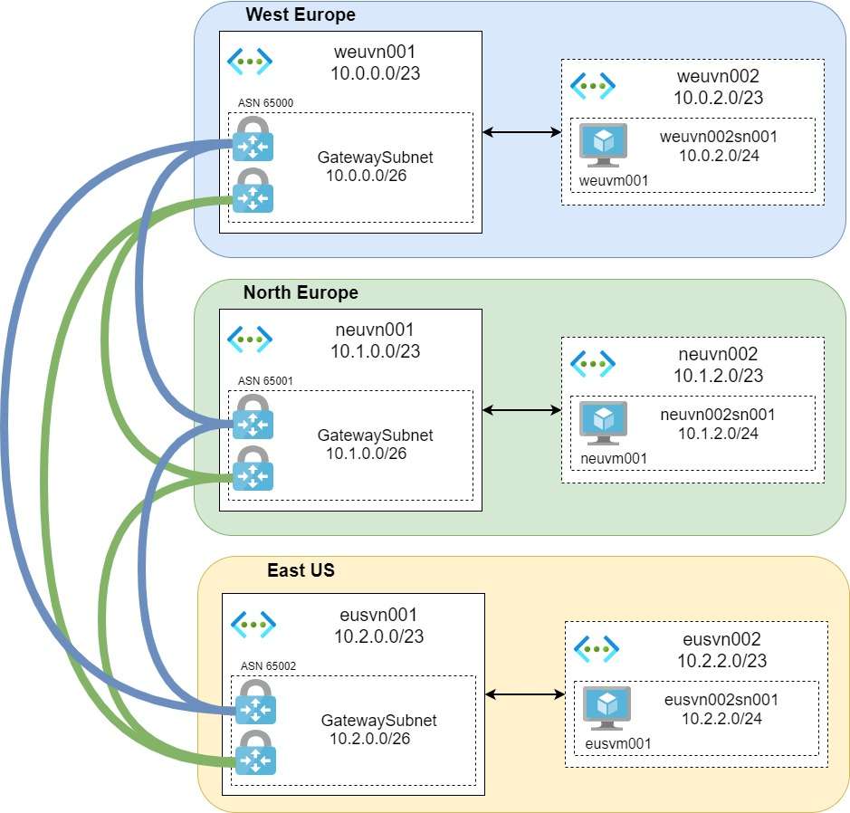

# Terraform Azure Full Mesh VPN & BGP

## Overview
This project provide some Terraform files to deploy a basic Azure hub and spoke infrastructure in 3 locations (West Europe / North Europe / East US) with full mesh VPN + BGP.

# High Level Design
- West Europe:
  - Hub VNet: 10.0.0.0/23
  - BGP ASN: 65000 
  - Spoke VNet: 10.0.2.0/23
- North Europe:
  - Hub VNet: 10.1.0.0/23
  - BGP ASN: 65001 
  - Spoke VNet: 10.1.2.0/23
- East US:
  - Hub VNet: 10.2.0.0/23
  - BGP ASN: 65002 
  - Spoke VNet: 10.2.2.0/23



# Implementation

## Requirements
You will need to install : 
* [Terraform](https://www.terraform.io/downloads.html) (tested with version v1.0.3)
* Terraform Provider (installed using command *terraform init*): 
  * azurerm

## Quickstart
The infrastructure will be implemented as described in the high level design but can be customized according to your needs.
````
> terraform init
> terraform plan
> terraform apply
````
If you want to connect to the VM to perform some test, you can retrive the password using ``terraform output vm_password`` (username : azureuser)